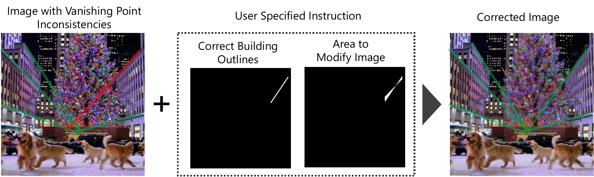

# ControlVP: Interactive Geometric Refinement of AI-Generated Images with Consistent Vanishing Points
This repository is the official code for the paper **ControlVP: Interactive Geometric Refinement of AI-Generated Images with Consistent Vanishing Points** by Ryota Okumura, Kaede Shiohara, Toshihiko Yamasaki

## Introduction
A user-guided framework for correcting vanishing point (VP) inconsistencies in AI-generated images using building contours as conditions.



## Installation

### Prerequisites

- Python 3.11+
- CUDA 12.1
- [uv](https://docs.astral.sh/uv/) package manager
- [git-lfs](https://git-lfs.com/)

### Setup

```bash
# Install uv (if not already installed)
curl -LsSf https://astral.sh/uv/install.sh | sh

# Install dependencies
uv sync

# Activate virtual environment
source .venv/bin/activate
```

## Training

You can train the model yourself by following the steps below, or skip directly to inference using our pre-trained weights.

### 1. Download the HoliCity dataset

Download the following files from the [HoliCity homepage](https://holicity.io/):

- [image](https://huggingface.co/yichaozhou/holicity/tree/main/perspective/image-v1)
- [normal](https://huggingface.co/yichaozhou/holicity/tree/main/perspective/normal-v1)
- [plane](https://huggingface.co/yichaozhou/holicity/blob/main/perspective/plane-v1.tar)
- [vanishing_points](https://huggingface.co/yichaozhou/holicity/blob/main/perspective/vpts-v1.tar)

Organize the dataset as follows (the parent directory can be anywhere):

```
<dataset_root>/
├── images/
├── normal_map/
├── planes/
└── vanishing_points/
```

### 2. Create the training dataset

#### 2.1 Configure paths

Edit `src/config/config.yaml` and update the paths to match your environment:

```yaml
dataset:
  image_base_dir: "/path/to/HoliCity/images"          # Downloaded HoliCity images
  vpts_base_dir: "/path/to/HoliCity/vpts-w-edges/"    # Output directory for edge information
  dataset_dir: "/path/to/HoliCity/dataset_w_vpts_edges/"  # Output directory for the dataset
```

#### 2.2 Run the script

```bash
chmod +x src/script/*.sh
./src/script/create_training_dataset.sh
```

### 3. Run training

#### 3.1 Configure the dataset path

Edit `src/script/train_controlnet_vp_loss.sh` and update the `--dataset_name` to match your environment:

```bash
--dataset_name=/path/to/your/dataset  # Change this
```

#### 3.2 Start training

```bash
./src/script/train_controlnet_vp_loss.sh
```

## Inference

### Quick Start
Run inference on the provided sample data using pre-trained weights:

```bash
uv run python src/inference/inpainting.py
```

### Using Your Own Trained Model

To use your own trained model, modify the `CONTROLNET_MODEL_PATH` in `src/inference/inpainting.py` 

```python
CONTROLNET_MODEL_PATH = "path/to/your/trained/model"
```

### Creating Custom Control Instructions

To prepare your own images for inference, use the [ControlVP GUI tool](https://github.com/RyotaOkumura/GUI_for_ControlVP). After creating control data with the GUI, update the `IMAGE_PATHS` and `image_set_indexes` variables in `src/inference/inpainting.py` to point to your custom data.

## Reference

If you find this work useful, please consider citing:

```bibtex
@article{okumura2025controlvp,
  title={ControlVP: Interactive Geometric Refinement of AI-Generated Images with Consistent Vanishing Points},
  author={Okumura, Ryota and Shiohara, Kaede and Yamasaki, Toshihiko},
  year={2025}
}
```

## ToDo
- [ ] Add evaluation code
- [ ] Update reference
- [ ] Add license info